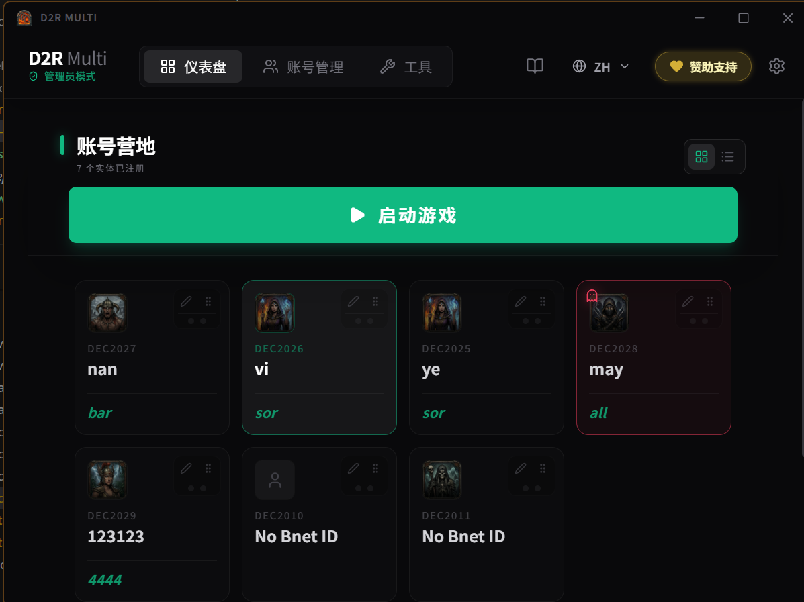
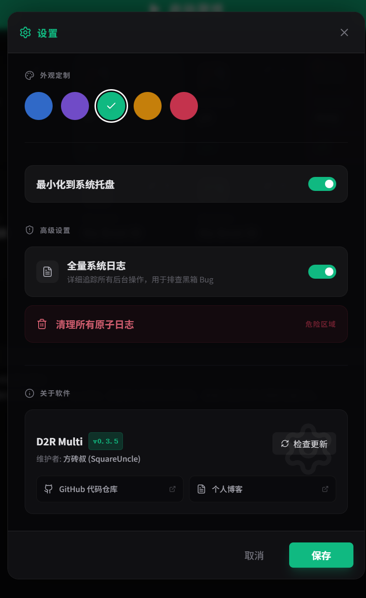
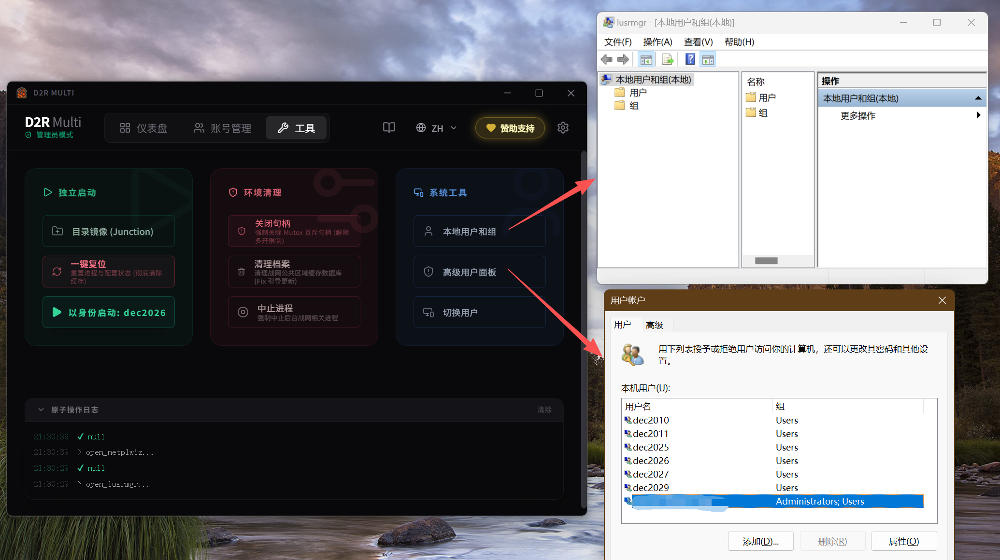

# D2R Multiplay (Rust Edition)

<div align="center">


[English](./README.md) | **简体中文**

</div>

**D2R Multiplay** 是专为 *暗黑破坏神2：重制版 (Diablo II: Resurrected)* 设计的高性能多开管理工具。

本项目是原版 C# 工具的 **Rust 轻量化重写版**。旨在解决原版体积庞大、依赖繁重的问题，通过底层语言重构实现了极致的轻量化与高性能。

## 🚀 核心特性

- **🛡️ 隔离引擎 (Isolation Engine)**：使用 Windows 用户沙盒机制启动游戏客户端，实现真正的环境隔离。
- **⚡ 零延迟捕获 (Zero-Latency)**：通过 Win32 Mutex (互斥体) 操作绕过战网的多开限制。
- **轻量化重构**：完全移除庞大的 .NET 运行时依赖，使用 Rust + Tauri 构建，体积更小，启动更快。
- **🔧 配置轮转 (Config Swapping)**：智能的 `product.db` 轮转机制，确保每个账号都能独立保存登录凭证 (Token)，互不干扰。
- **🌍 国际化支持 (i18n)**：
  - 完美支持 简体中文、繁体中文、英语、日语、韩语。
  - 系统托盘菜单会自动跟随应用语言切换。
- **🎨 极简 UI**：采用现代化、高效的极简界面，注重核心交互体验。
- **📂 绿色便携 (Portable)**：提供单文件绿色版 (`.exe`)，无需安装，即点即用。

## 🛠️ 技术栈

- **后端**: Rust (Win32 API, Windows crate, Serde)
- **前端**: React 19, TypeScript, TailwindCSS, ShadCN
- **框架能力**: Tauri v2, 系统托盘, 进程管理, **统一通知系统**, **全量日志追踪**

## 📦 安装与使用

### 方法 1: 绿色便携版 (推荐)

1. 在 [Releases](https://github.com/YOUR_USERNAME/d2r-rust/releases) 页面下载 `d2r-rust.exe`。
2. 将其放置在任意位置（例如桌面）。
3. **右键 -> 以管理员身份运行** (必须使用管理员权限以执行进程隔离)。

### 方法 2: 源码编译

请确保已安装 [Rust](https://rustup.rs/) 和 [Node.js](https://nodejs.org/) 环境。

```bash
# 1. 克隆仓库
git clone https://github.com/YOUR_USERNAME/d2r-rust.git
cd d2r-rust

# 2. 安装依赖
npm install

# 3. 开发模式 (热重载)
npm run tauri dev

# 4. 构建发布版 (生成绿色版 EXE 和 MSI 安装包)
npm run tauri build
```

编译产物位于 `src-tauri/target/release/` 目录下。

## 📸 界面预览

<div align="center">

### 主控制面板



### 账号配置


### 全局设置



### 系统用户校验



</div>

## ⚙️ 配置文件

- 应用配置存储于：`%APPDATA%/com.d2rmultiplay.ui/config.json`
- 账号快照存储于：`%APPDATA%/com.d2rmultiplay.ui/snapshots/`

## 📝 0.3.8 更新详情

- **系统日志一键访问**: 在设置中新增“查看系统日志”功能，通过默认文本编辑器快速调取诊断日志，极大简化了故障排查流程。
- **日志持久化优化**: 引入了 5MB 的日志文件上限管理，超出后自动滚动截断，解决长期多开运行可能带来的磁盘空间占用问题。
- **配置路径动态解析**: 移除所有硬编码的日志与配置文件路径，改用系统环境变量与 Tauri API 动态定位，适配更多安装环境。

## 📝 0.3.7 更新详情

- **多账户管理模式**: 为重度多开用户新增“多账户管理模式”开关。开启后提供“一键启动”（全流程）与“仅开战网”（仅环境切换）双按钮界面。
- **Dashboard 架构重构**: 对 `Dashboard.tsx` 进行了 75% 的代码瘦身与组件化重构，提升了 UI 性能与维护性。
- **状态感知优化**: 即使在双按钮模式下，按钮也能实时感知游戏各级运行状态（就绪/启动中/运行中）。
- **主题化色彩**: 引入 CSS 变量控制核心交互颜色，确保在不同 UI 主题下的一致性，消除了硬编码样式。
- **全量语言同步**: 完成中（简/繁）、英、韩、日五国语言包的深度同步，消除翻译 Key 遗漏。

## 📝 0.3.6 更新详情

## ⚠️ 免责声明

本工具通过操作系统进程管理和文件系统操作来实现多开功能。

- 使用风险自负。
- 请务必遵守游戏发行商的服务条款 (ToS)。

## 🛡️ 隐私政策

您的隐私对我们至关重要。请查看我们的[隐私政策](./PRIVACY_POLICY_CN.md)以了解我们如何处理数据。

## 📝 开源协议

MIT License.
