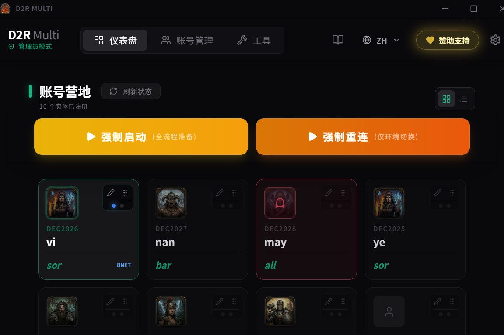
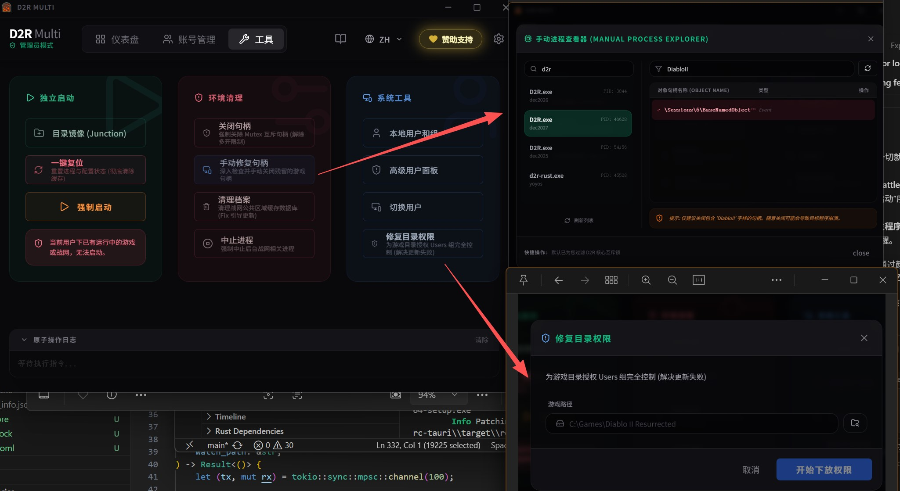

# D2R Multiplay (Rust Edition)

[English](./README.md) | **简体中文**

**D2R Multiplay** 是专为 *暗黑破坏神2：重制版 (Diablo II: Resurrected)* 设计的高性能多开管理工具。

本项目是原版 C# 工具的 **Rust 轻量化重写版**。通过底层语言重构实现了极致的轻量化与工业级的运行稳定性。

## 🚀 核心特性

- **🛡️ 隔离引擎 (Isolation)**：使用 Windows 用户沙盒机制启动游戏，实现真正的环境与配置隔离。
- **⚡ 互斥体透明化 (Zero-Mutex)**：秒级清理全局互斥锁 (`DiabloII Check For Other Instances`)，实现无限多开。
- **🏥 基础设施预检 (Health Check)**：启动前自动校验战网路径、目录权限及沙箱状态，消除 90% 的启动报错。
- **🎨 渐进式交互 (Progressive UI)**：三阶颜色状态感知（绿色/黄色/橙色），实时反馈战网与游戏各阶段运行深度。
- **🔧 配置自动轮转**：智能管理 `product.db`，确保每个账号独立保存登录凭证，无需反复输入密码。
- **📂 绿色便携**：单文件 `.exe` 发布，无任何环境依赖，即点即用。

## 📸 界面展示

### 1. 账号营地 (主控制台)

*三阶颜色反馈：绿色(就绪)、黄色(战网运行)、橙色(游戏运行)*

### 2. 交互式工具箱

*内置基础设施健康检查与高级进程管理工具*

## 🛠️ 逻辑完整性与人工介入

为了确保在复杂 Windows 环境下的 100% 可用性，MDM 加入了完善的“异常补偿”逻辑：

1. **自动流程闭环**：程序会自动尝试修复权限、清理残留进程和互斥体。
2. **人工干预入口**：当自动化脚本触及系统边缘（如特定句柄被内核锁死）时，通过内置的 **“手动进程查看器 (Process Explorer)”** 和 **“快速修复工具”**，用户可以零门槛介入，确保系统逻辑的最终完整性。
3. **静默背景同步**：改进的递归轮询机制在保证实时性的同时，实现了 UI 的静默刷新，不干扰正常操作。

## 📦 快速开始

### 运行环境

- Windows 10/11 (x64)
- 需要 **管理员权限** 运行

### 获取程序

1. 在 [Releases](./CHANGELOG.md) 页面（或查看 [更新日志](./CHANGELOG.md)）下载最新版。
2. 运行 `d2r-rust.exe` 即可开始配置。

## 🛠️ 技术栈

- **后端**: Rust (native Win32 API, windows-rs)
- **前端**: React 19, TypeScript, TailwindCSS (v4 logic), ShadCN/ui
- **架构**: Tauri v2 异步桥接, 跨用户进程注入, 句柄泄露探测

## ⚠️ 免责声明

本工具仅供技术研究与个人便利使用。

- 请务必遵守游戏发行商的服务条款 (ToS)。
- 使用本工具产生的任何后果由使用者自负。

## 📝 历史更新

详细的迭代细节请查看：[**CHANGELOG.md (更新日志)**](./CHANGELOG.md)

## 📝 开源协议

MIT License.
