# D2R Multi 使用手册 / User Guide

**适用版本 / Applies to: v0.7.x**

> 🌐 中文见下方第一部分；**English guide is in the second half** (jump to [English Guide](#english-guide)).
> 配图按编号引用，图片文件位于 `doc/images/`，清单见 `doc/images/README.md`。
> Figures are referenced by number; image files live in `doc/images/` (manifest: `doc/images/README.md`).

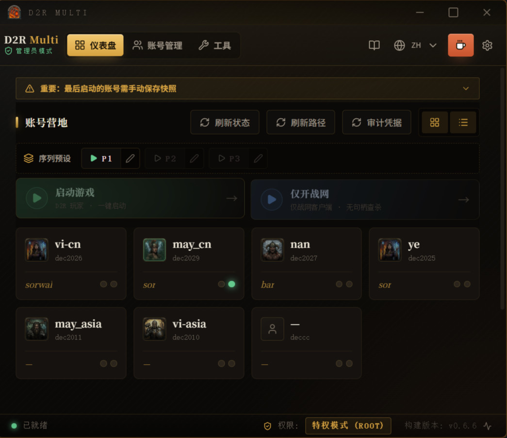

---

# 中文手册

## 目录

1. [简介](#1-简介)
2. [准备工作](#2-准备工作)
3. [首次启动与初始化](#3-首次启动与初始化)
4. [核心概念·简明原理](#4-核心概念简明原理)
5. [添加与管理账号](#5-添加与管理账号)
6. [仪表盘与启动](#6-仪表盘与启动)
7. [序列自动启动](#7-序列自动启动)
8. [工具箱](#8-工具箱)
9. [设置](#9-设置)
10. [常见问题与排错](#10-常见问题与排错)
11. [附录](#11-附录)

---

## 1. 简介

**D2R Multi** 是一款面向《暗黑破坏神 II：重制版》（Diablo II: Resurrected）的**多开 / 多账号管理器**，运行于 Windows，使用 Rust + Tauri 构建。

它解决三件事：

- **同机多开**：在一台电脑上同时运行多个 D2R 实例。
- **多战网账号一键切换**：在多个 Battle.net 账号之间快速切换并启动，互不串号。
- **干净隔离**：每个游戏账号绑定一个独立的 Windows 用户，登录态、配置、缓存彼此隔离。

不玩 D2R 多开、只想**免登录切换多个战网账号**？同样适用——把账号标记为「非 D2R 账户」即可（§5.2）。

> 一句话原理：每个账号 = 一个 Windows 用户；启动时切换战网的 `product.db` 快照、清理 D2R 的实例锁，再以目标用户身份拉起战网。详见 [第 4 章](#4-核心概念简明原理)。

---

## 2. 准备工作

### 2.1 系统要求

- Windows 10 / 11（64 位）。
- **必须以管理员身份运行**：跨用户启动进程、清理内核句柄、修复权限都需要管理员权限。
- 游戏/镜像所在分区为 **NTFS**：多开的目录镜像（Junction）是 NTFS 的功能，exFAT / FAT32 分区（常见于移动硬盘）不支持（§4.6）。

### 2.2 Battle.net 安装要求

- **路径固定**：必须安装在默认位置 `C:\Program Files (x86)\Battle.net`。
- 安装时选择「**为这台电脑的所有用户安装**」。
- **不支持自定义盘符**（出于跨用户权限的原因）。

> 如果你之前把战网装在别的盘，请卸载后按上述方式重装（安装界面下方有「为这台电脑的所有用户安装」勾选项）。

### 2.3 D2R 游戏路径

- 游戏本体（D2R）路径**灵活**，可放任意盘（D:、E: 等）。
- 路径可在「设置」中指定，或由程序在首次成功启动时自动捕获记录。

### 2.4 账号类型

- ✅ **仅支持本地账号**（Local Account）。
- ❌ 不支持**微软账号**（云端认证与 `CreateProcessWithLogonW` 不兼容）。
- ❌ 不支持**域账号**（家庭网络通常连不到域控制器）。

---

## 3. 首次启动与初始化

### 3.1 以管理员身份运行

右键 `d2r-rust.exe` →「以管理员身份运行」。（也可在 exe 属性 → 兼容性中勾选「以管理员身份运行此程序」一劳永逸。）

### 3.2 初始化向导

首次启动（未检测到配置）会弹出初始化向导：

- **新建配置**：从零开始，配置写入默认数据目录。
- **载入已有配置**：指向一个已包含 `config.json` 的文件夹（便携/迁移场景）。

### 3.3 数据目录

- 程序的配置、快照、日志都保存在「数据目录」。
- 可在「设置 → 数据管理」查看与更改位置（便携模式 / 重定向到其它盘）。
- **日志文件**位于 `数据目录\logs\d2r-multiplay.log`（v0.6.6 起跟随数据目录，不再写在 exe 旁）。

---

## 4. 核心概念·简明原理

全部机制归结为三句话，理解了就能看懂日志、定位报错：

- **免登录的核心 = Windows 多用户隔离**（§4.1）：战网登录态按 Windows 用户各存一份；凭据与用户密码绑定，密码不动，免登录就持久。
- **多开的核心 = 路径 + 句柄**（§4.2–§4.5）：路径靠快照切换保障、靠你亲自设立的**基准路径**守护；实例锁句柄的清理已非常成熟，无需操心。
- **系统依赖 = NTFS**（§4.6）：目录镜像（Junction）只在 NTFS 分区可用。

### 4.1 每个账号 = 一个独立 Windows 用户（免登录的核心）

Battle.net 的登录态、配置、缓存按 **每用户 `%AppData%`** 隔离。让每个游戏账号绑定一个独立 Windows 用户，就能让多个战网账号同时保持登录、互不污染。程序用目标用户的身份（`CreateProcessWithLogonW` + 加载用户配置）拉起战网。

> 🔑 **免登录能否持久，取决于密码是否持久。** 战网把「记住登录」的凭据加密保存在该 Windows 用户名下，加密密钥与这个用户的**密码**绑定——**一旦修改该用户的 Windows 密码，凭据随之失效，战网就会要求重新登录**。所以：给隔离用户设一个固定密码、在账号编辑里勾选「密码永不过期」（§5.2），之后不要再改它。

### 4.2 product.db 快照切换

Battle.net 的 **Agent.exe 是全机器共享的单一进程**，它实时读取 `C:\ProgramData\Battle.net\Agent\product.db` 来同步「当前用哪个安装 / 路径」。因为无法实时挂钩 D2R 的启动，程序采用**预置快照**策略：

> 启动顺序：**备份当前快照 → 杀掉战网 + Agent → 注入目标账号的 product.db → 以目标用户拉起战网**。

这样 Agent 重启后读到的就是目标账号的路径，避免串号 / 串路径。

### 4.3 D2R 实例锁是 Event 类型

D2R 启动时会创建一个命名内核对象 `DiabloII Check For Other Instances` 来阻止多开。**注意：它是 `Event` 类型，不是互斥量（Mutant）。** 多开的本质就是在拉起新实例前**关闭这把锁**——程序的「清理互斥锁」就是干这个，这套句柄处理已非常成熟，正常使用无需操心。

### 4.4 托管模式 vs 高级（快速）模式

- **托管模式（默认）**：完整流程——环境审计、自动快照备份、句柄清理、文件对齐，最稳。
- **高级 / 快速模式**：精简流程，跳过部分感知与备份，仅做必要清理，更快但更「裸」。

### 4.5 自动备份与基准路径

多开切换的命脉是**路径**：`product.db` 里的其他信息（产品、版本等）战网登录后都会联网自愈，唯独游戏路径不会——串了就是串了。所以路径必须**由人拍板**：每个 D2R 账号在编辑时亲自确认一条**基准路径**（= 战网客户端里配置的游戏目录；用镜像时填镜像路径），程序此后只负责核对。

自动备份在**每次启动前**轮巡进行：机器上的 `product.db` 归属哪个账号（程序的注入台账说了算）、且内容与该账号的**基准路径**一致，就自动存入该账号的快照槽。因此**最后启动的账号也无需手动收尾**——它会在你下次启动任意账号时（哪怕隔了重启）被自动补备份。路径与基准不符时程序会封存现场并弹窗请你裁决，存疑一律不落盘，确保快照干净、不串号。「非 D2R 账户」不参与基准校验，凭归属直接备份（§5.2）。

「双在位」= 同一用户的**战网与 D2R 同时在线**。它现在只用于自学/展示游戏路径，不参与备份判定。由于战网每次只能开一个，同一时刻最多只有一个账号处于双在位。

> 💡 **想立即备份？** 点账号卡片上的 **「保存快照」**（图19）随时手动存一份；用序列（第 7 章）启动时，全部完成后也可点迷你窗的绿色 **「完成并备份」**（图20）立即保存最后一个账号的快照。两者都是可选的即时备份——不点也会在下次启动时自动补上。

### 4.6 目录镜像（Junction）与 NTFS

多个账号共用同一份游戏安装时，程序用 **目录联接（Junction）** 给每个账号造一条自己的「镜像路径」——战网各认各的路径，实际都指向同一份文件：不占多份磁盘，路径又互不打架。Junction 是 **NTFS 文件系统**的功能，镜像所在分区必须是 NTFS（系统盘默认即是；移动硬盘常见的 exFAT / FAT32 不行）。注意：账号的**基准路径应填战网里配置的镜像路径**，而不是真实安装目录。

---

## 5. 添加与管理账号

### 5.1 账号管理界面

「账号管理」页以表格列出所有账号：头像、Windows 用户、战网标识、游戏路径、备注、操作（编辑/删除），右上角可新增账号、刷新路径。（见图5）

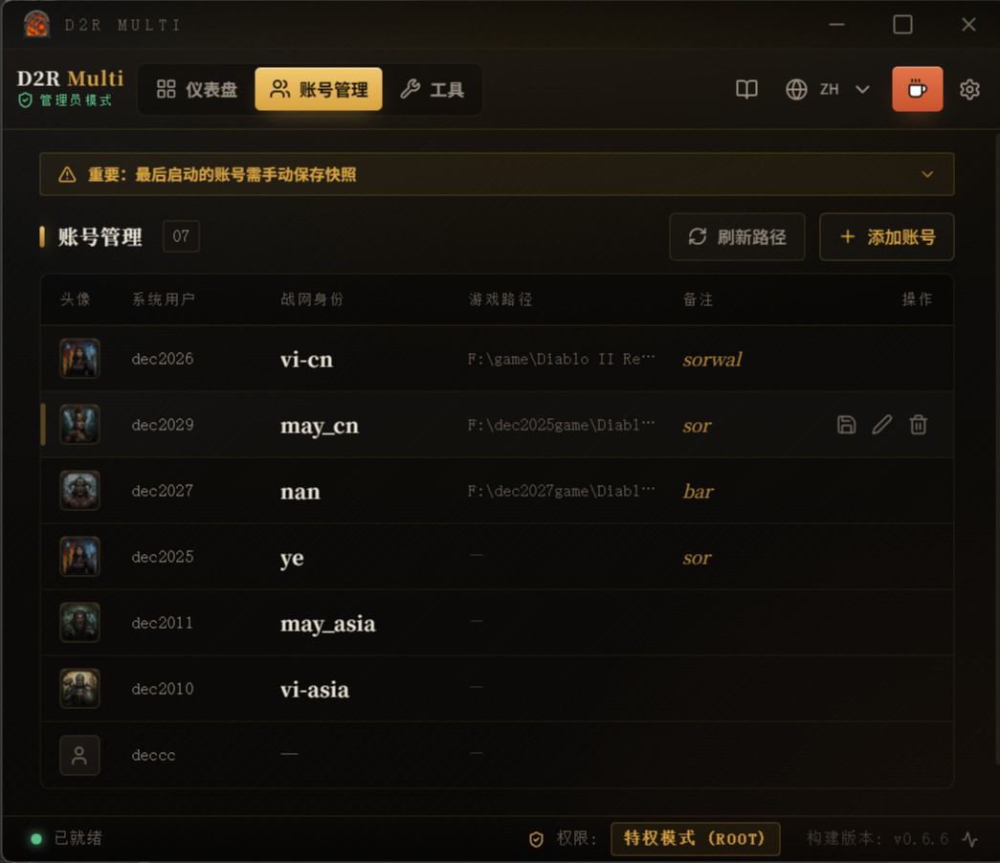

### 5.2 新增 / 编辑账号

点击新增或某行的「编辑」，打开账号弹窗，分为几个区块（见图6）：

- **用户绑定**：选择已有 Windows 用户，或**新建**一个（新建需要管理员）。支持浅扫 / 深扫（含域/微软账号检测）。
- **密码**（新建必填，仅当前登录用户可留空）：目标 Windows 用户的密码（用于以该用户身份启动）；可显示/隐藏。提示：使用 PIN / Windows Hello 的账号需注意。
- **密码策略**：建议勾选「密码永不过期」——凭据与密码绑定，密码一改战网就要重新登录（§4.1）；「自动修复密码策略」解决某些 0x8007xxxx 登录报错；「跳过配置同步」= 手动模式，该账号不参与自动备份。
- **账户类型**：勾选「**非 D2R 账户**（仅战网免登录切换）」= 该账号不玩 D2R 多开，只用隔离做免登录切换；不要求基准路径，备份凭归属自动进行。
- **基准路径**（D2R 账号新建必填）：战网客户端里配置的游戏目录（用目录镜像时填**镜像路径**）。可点「浏览」选目录，或一键采用快照建议；它是自动备份的唯一比对依据（§4.5）。勾选「**唯一基准**」= 路径不符时不弹窗、直接静默取消备份（适合路径从不变动的账号）。
- **头像**：7 个职业图标（亚马逊/法师/死灵/圣骑/野蛮人/德鲁伊/刺客）或自定义。
- **备注与战网 ID**：用于辨识（如「主号·法师」「打孔骡子」），以及窗口命名。
- **游戏路径**：程序自动学习到的真实路径，仅用于展示/诊断（比对一律以基准路径为准）。

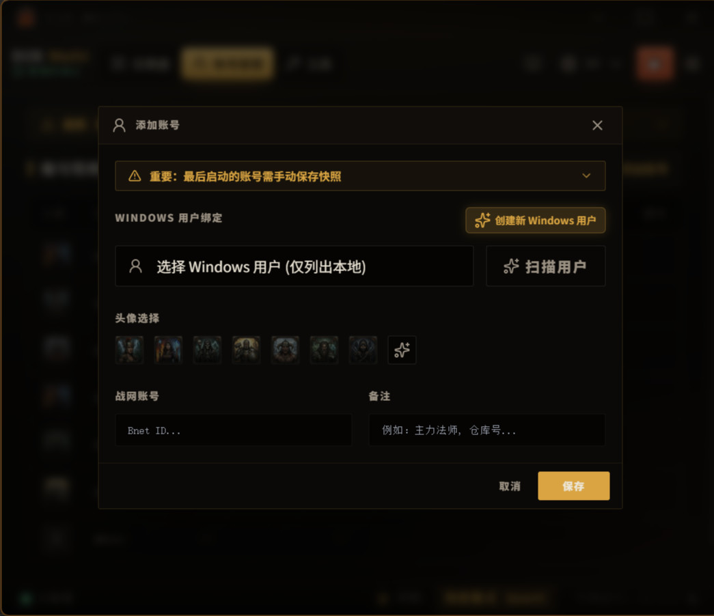

### 5.3 创建 Windows 用户

若还没有对应的 Windows 用户，可在账号弹窗里「新建用户」，或用 [工具箱](#8-工具箱) 的「本地用户和组 / 高级用户面板」创建。**新建的用户建议先手动登录一次**以完成初始化——最好顺手在这次手动登录里把战网也登进去，而不是留给工具的首次跨用户启动去做。原因很朴素：一个从没在本机登录过的全新用户，走跨用户桥接（`CreateProcessWithLogonW`）去完成"系统首次初始化 + 战网首次登录"这两件事，偶尔会有点不确定；自己手动登一次、把桌面初始化走完，之后再交给工具做免登录切换，会顺畅很多。

### 5.4 幽灵图标 👻

账号若显示幽灵图标，表示配置里指定的 Windows 用户在本机**不存在**（被删或改名）。处理见 [排错](#10-常见问题与排错)。

---

## 6. 仪表盘与启动

### 6.1 卡片视图与列表视图

仪表盘支持两种视图：

- **卡片视图**：可视化网格，适合少量账号。（见图1 的主界面即卡片视图）
- **列表视图**：高密度表格，适合管理 10+ 账号。（见图8）

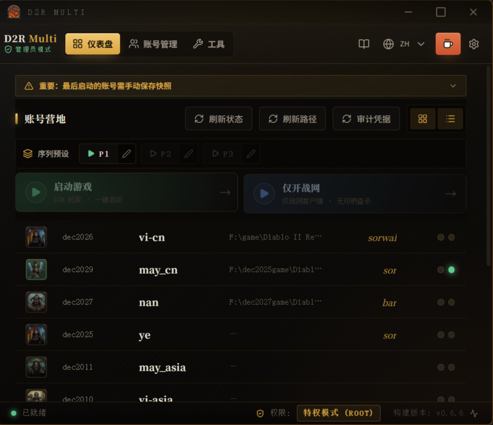

### 6.2 状态指示

- **蓝色** = 该账号的 Battle.net 在线。
- **绿色** = 该账号的 D2R 在线。

### 6.3 启动游戏 / 仅战网

- **启动游戏**：完成身份切换并直接拉起游戏。
- **仅战网**：只切换环境并打开 Battle.net 客户端（用于手动登录、选区、更新）。

（见图9）

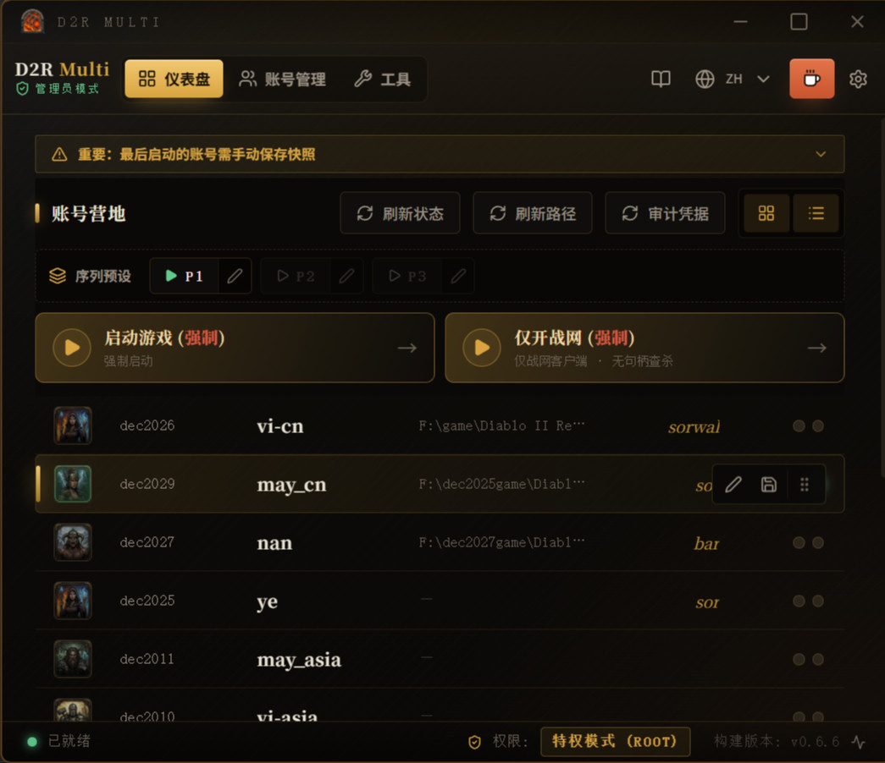

### 6.4 强制启动

当检测到战网或游戏已在运行时，启动按钮会变为**琥珀色并带「(强制)」**后缀。强制启动会先杀掉相关进程再启动，并绕过「软性节流」保护（用于切换账号的常见场景）。

### 6.5 手动保存快照

每个账号的卡片 / 列表行上都有 **「保存快照」** 按钮（软盘图标），把**当前机器上的 product.db** 存入该账号的快照槽。适合在改完战网/游戏设置后**立即**存一份，不必等下次启动的自动轮巡（§4.5）。（见图19）

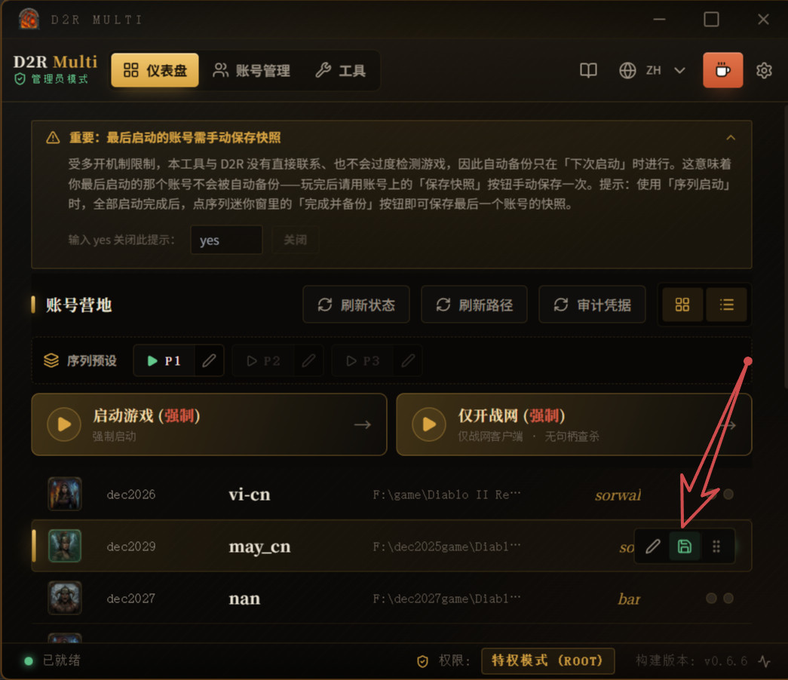

### 6.6 其它操作

- **拖拽排序**：拖动账号调整顺序，自动保存。
- **刷新状态 / 刷新路径**：重新探测进程与游戏路径。
- **Vault 审计**：检查凭据保险库完整性。

### 6.7 原子日志

仪表盘底部的日志面板实时显示每一步操作，便于排查启动过程。

---

## 7. 序列自动启动

适合「一键依次拉起多个账号」。

### 7.1 序列预设 1–3

仪表盘顶部有 3 个序列预设槽（P1–P3）。每个槽保存一组按顺序启动的账号；点击播放即校验并启动，点击铅笔进入编辑。编辑弹窗为左侧账号池、右侧执行队列，可添加、上下移动排序、删除；保存即生效。被删账号会标记为无效。（见图10）

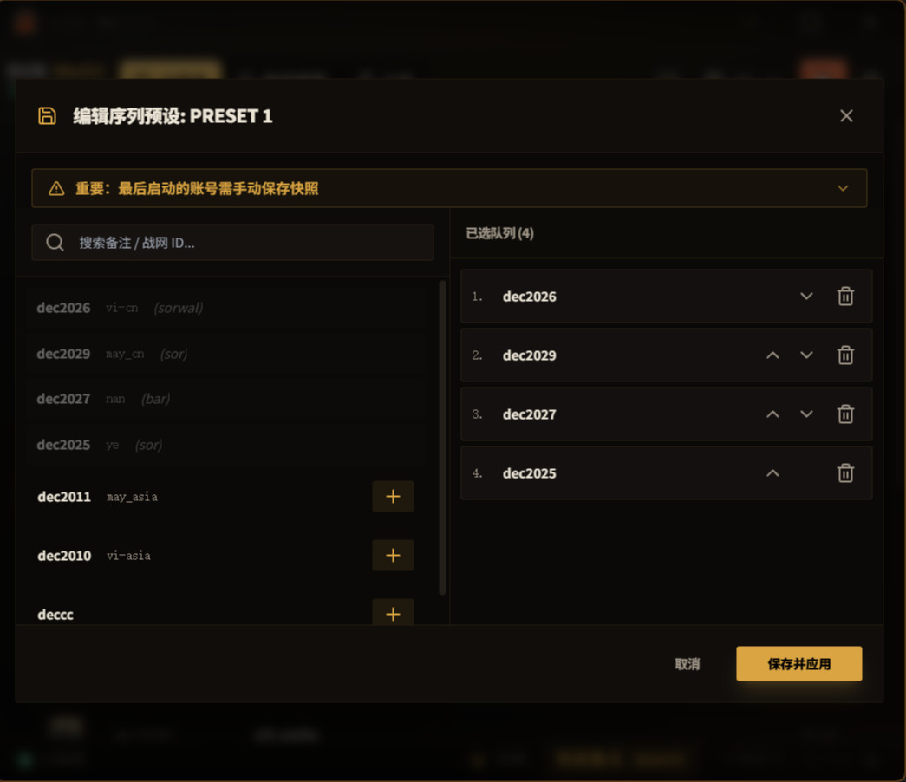

### 7.2 序列迷你窗

序列运行时会出现一个置顶迷你悬浮窗，显示当前预设与进度（第几/共几），点 **「启动」** 步进下一个账号，点 ✕ 可随时中断。（见图12）

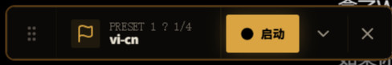

### 7.3 完成并备份

全部账号启动完毕后，迷你窗按钮变为绿色的 **「完成并备份」**：点击即**立即**保存最后一个账号的快照再关窗；直接点 ✕ 则仅关窗（该账号会在下次启动时自动补备份，见 §4.5）。若此时检测到其它账号的战网已在运行（路径数据已被换走），程序会**拒绝备份并提示**，请改用该账号卡片上的「保存快照」。（见图20）

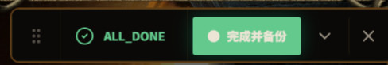

---

## 8. 工具箱

「工具」页为三列布局，顶部还有两个诊断按钮。（见图13）

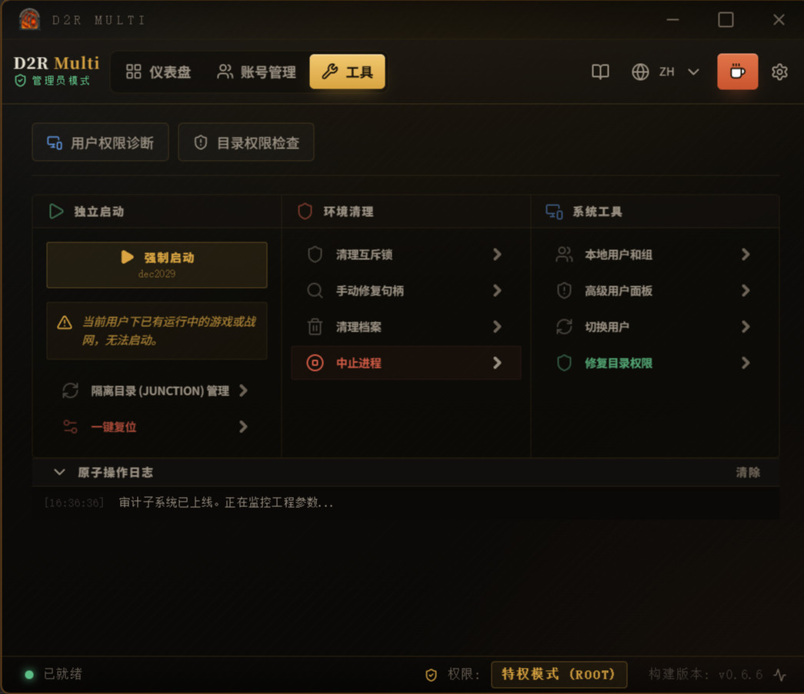

### 8.1 独立启动

- **强制 / 独立启动**：对选中账号直接启动（运行中时为琥珀色强制）。
- **目录镜像（Junction）**：为多开创建隔离的目录联接。
- **系统复位**：杀进程 + 清理各种配置/缓存状态（危险操作）。

### 8.2 环境清理

- **清理互斥锁**：关闭 D2R 的实例锁（即 §4.3 的 Event 锁），允许多开。
- **手动修复句柄**：打开进程/句柄查看器，按进程检视并强制关闭单个句柄（高级排障）。（见图14）
- **清理档案**：清理 Battle.net 公共缓存（修复更新死循环）。
- **中止进程**：强制结束后台战网相关进程。

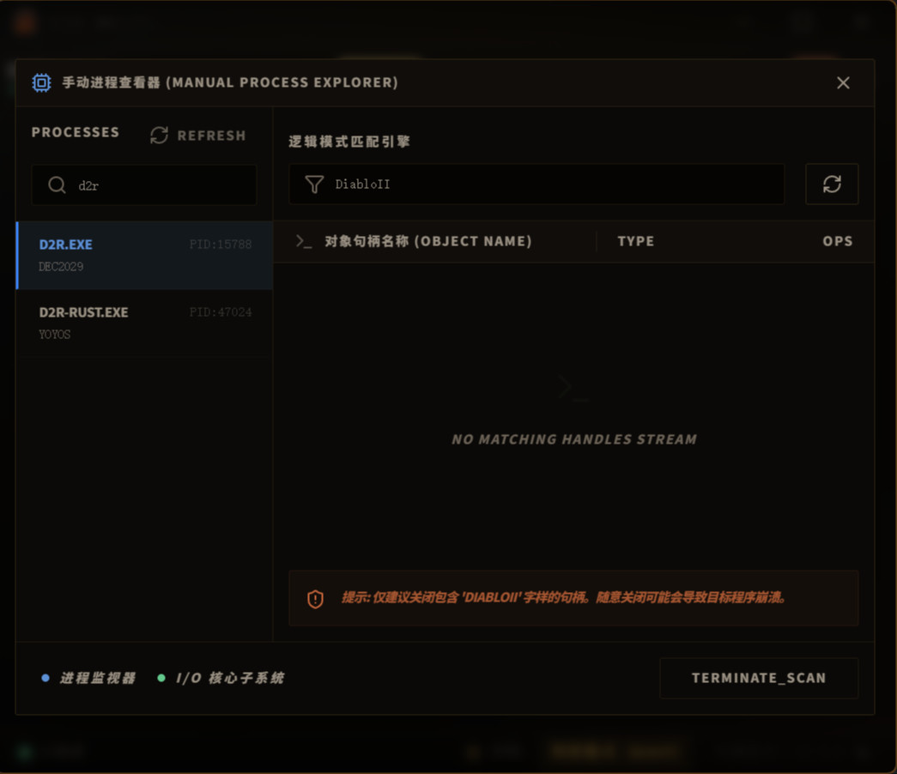

### 8.3 系统工具

- **本地用户和组**：打开 `lusrmgr.msc`。
- **高级用户面板**：打开 `netplwiz`。
- **切换用户**：打开 Windows 快速切换用户界面。
- **修复目录权限**：用 `icacls` 给游戏目录授权，让标准用户可读写（解决更新权限问题）。输入游戏目录路径后执行，下方面板会输出修复日志。

### 8.4 诊断

- **用户权限诊断**：检查 Windows 用户是否已初始化、是否有微软账号冲突等。
- **目录权限检查**：检查游戏目录的 ACL 与可访问性。
- 结果以 通过 / 失败 / 警告 呈现。（见图16）

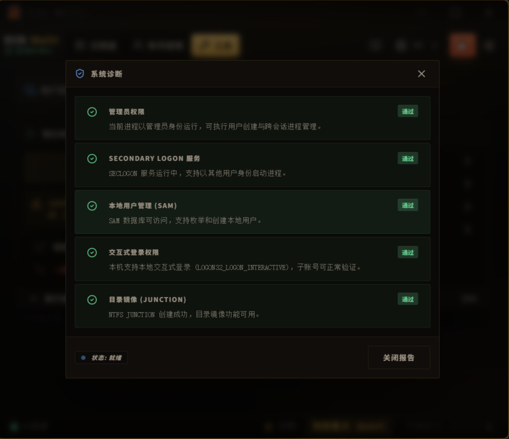

---

## 9. 设置

### 9.1 外观

主题：**熔炉（Forge）/ 曜石（Obsidian）/ 日光（Daylight）**，即点即换并持久保存。（见图17）

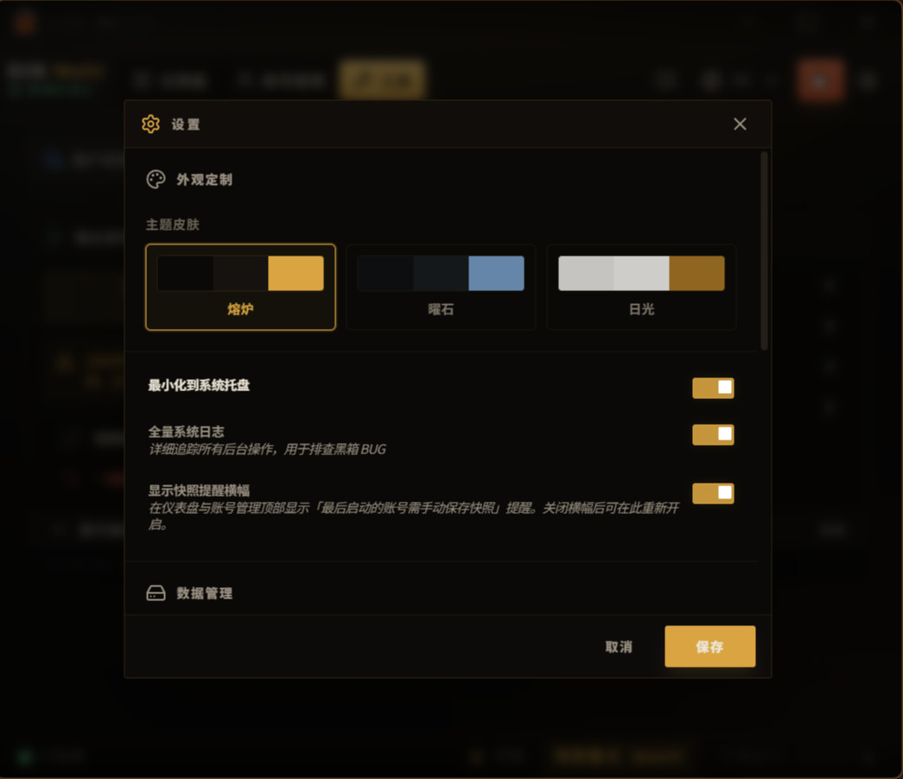

### 9.2 通用

- **最小化到托盘**：关闭即最小化而非退出。
- **完整系统日志**：用于调试。

### 9.3 数据管理

- 查看当前数据目录、打开目录、载入外部配置、更改数据位置。
- 若 exe 在 C 盘会有提醒（建议放到数据盘）。

### 9.4 窗口命名

- 开关「自动重命名游戏窗口」。
- 4 种格式：仅备注 / 仅战网 ID / 仅 Windows 用户名 / 全量（用户 | 战网 | 备注）。（见图18）

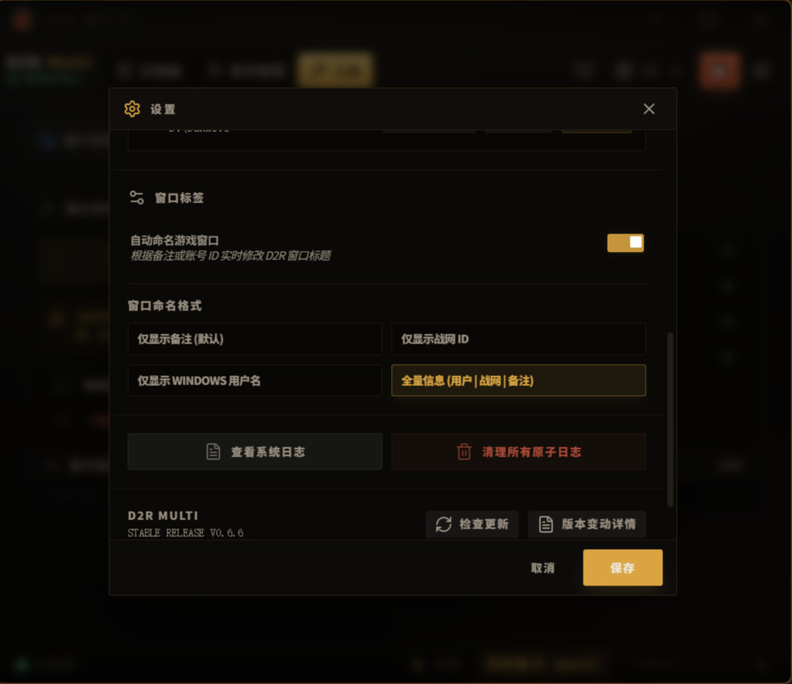

### 9.5 日志与维护

- **查看系统日志**：打开日志文件（位于 `数据目录\logs\`）。
- **清空所有日志**。

### 9.6 检查更新

- 手动检查更新；可选自动更新（安装包）或手动下载（便携版）。

---

## 10. 常见问题与排错

- **游戏更新失败 / 权限不足**：隔离账号是标准用户，可能无权更新游戏文件。用「工具 → 修复目录权限」，或手动给游戏文件夹的 **Users 组**「完全控制」。
- **幽灵图标 👻**：配置里的 Windows 用户在本机不存在。请重建同名用户，或编辑账号改绑现有用户。
- **多开起不来 / 撞锁 / 启动冲突**：先「清理互斥锁」；仍不行用「手动修复句柄」检查是否有残留的 `DiabloII Check For Other Instances`（Event）。
- **战网找不到**：确认战网在 `C:\Program Files (x86)\Battle.net` 且为「所有用户」安装；否则卸载重装（见 §2.2）。
- **微软账号 / PIN 登录问题**：改用本地账号（见 §2.4）。
- **升级后弹出「基准路径已自动同步」**：一次性升级报告——程序已从现有快照为列出的账号自动填好基准路径；列在"仍需手动标定"里的账号，请去账号编辑确认基准（或勾选「非 D2R 账户」）。点「知道了」后不再弹。
- **启动时弹出「基准路径不符」裁决窗**：当前 `product.db` 里的路径与该账号的基准不一致。若你**确实改过**游戏路径 → 选「更新基准并备份」；说不清原因 → 选「取消备份」，快照保持原样、绝不污染（宁可少备一次，不可备错一次）。
- **换了游戏目录怎么办**：在战网里改完路径后，到账号编辑里更新基准路径；或等下次启动弹裁决窗时选「更新基准并备份」。
- **改了 Windows 密码后战网要求重新登录**：正常现象——免登录凭据与该用户的密码绑定（§4.1）。重新登录一次即可恢复；同时记得回账号编辑更新存储的密码，之后尽量别再改。
- **新建账号首次启动战网登录卡住 / 没反应**：多半是全新 Windows 用户第一次登录，恰好撞上工具跨用户启动。建议手动切换到该用户桌面（Win+L →「切换用户」），在里面把系统初始化走完并登一次战网（见 §5.3），之后再回来用工具做免登录切换，通常就顺畅了。
- **怎么看日志**：`数据目录\logs\d2r-multiplay.log`，或「工具 → 查看系统日志」。

---

## 11. 附录

### 11.1 术语表

- **托管模式 / 高级模式**：完整流程 vs 精简快速流程（§4.4）。
- **快照（product.db）**：战网 Agent 的安装/路径数据库，按账号切换（§4.2）。
- **实例锁**：D2R 防多开的命名 Event 对象（§4.3）。
- **基准路径**：用户在账号编辑中亲自确认的战网内游戏目录，自动备份的唯一比对依据（§4.5）。
- **唯一基准**：账号选项——路径不符时不弹窗，静默取消备份（§5.2）。
- **非 D2R 账户**：只做战网免登录切换、不玩 D2R 多开的账号；不要求基准路径（§5.2）。
- **目录镜像（Junction）**：NTFS 目录联接，给每个账号一条独立路径、指向同一份游戏安装（§4.6）。
- **双在位**：同一用户战网与 D2R 同时在线；现仅用于路径学习，不参与备份判定（§4.5）。

### 11.2 配图清单

见 `doc/images/README.md`。

### 11.3 从源码构建

需安装 Rust 与 Node.js（v18+）：

```bash
npm install
npm run tauri dev            # 开发
npm run tauri build          # 生产（完整打包，需签名密钥）
npm run tauri build -- --no-bundle   # 仅出绿色版 exe（最快）
```

---
---

<a id="english-guide"></a>
# English Guide

> Figures are shared with the Chinese guide above and referenced by the same numbers (`doc/images/NN-*.jpg`).

## Table of Contents

1. [Introduction](#1-introduction)
2. [Prerequisites](#2-prerequisites)
3. [First Run & Setup](#3-first-run--setup)
4. [How It Works (Concise)](#4-how-it-works-concise)
5. [Adding & Managing Accounts](#5-adding--managing-accounts)
6. [Dashboard & Launching](#6-dashboard--launching)
7. [Sequencer](#7-sequencer)
8. [Tools](#8-tools)
9. [Settings](#9-settings)
10. [Troubleshooting](#10-troubleshooting)
11. [Appendix](#11-appendix)

---

## 1. Introduction

**D2R Multi** is a **multi-boxing / multi-account manager** for *Diablo II: Resurrected* on Windows, built with Rust + Tauri.

It does three things:

- **Run multiple D2R instances** on one PC at the same time.
- **Switch between Battle.net accounts** quickly and launch them without cross-contamination.
- **Clean isolation**: each game account is bound to its own Windows user, so login state, config, and cache stay separate.

Don't multibox D2R and just want **login-free switching between Battle.net accounts**? That works too — mark the account as a "Non-D2R account" (§5.2).

> In one line: each account = one Windows user; on launch the app swaps Battle.net's `product.db` snapshot, clears D2R's instance lock, then starts Battle.net as the target user. See [Chapter 4](#4-how-it-works-concise).

---

## 2. Prerequisites

### 2.1 System

- Windows 10 / 11 (64-bit).
- **Must run as Administrator**: cross-user launching, kernel-handle cleanup, and permission fixes all require it.
- The game/mirror partition must be **NTFS**: the multi-boxing directory mirror (junction) is an NTFS feature — exFAT / FAT32 (common on external drives) won't work (§4.6).

### 2.2 Battle.net Install

- **Fixed path**: must be the default `C:\Program Files (x86)\Battle.net`.
- During install, choose "**install for all users of this computer**".
- **No custom drive** (a cross-user permissions constraint).

> If Battle.net is installed elsewhere, uninstall and reinstall as above (the installer has an "install for all users of this computer" checkbox near the bottom).

### 2.3 D2R Game Path

- The game (D2R) path is **flexible** (any drive). Set it in Settings, or let the app auto-capture it on first successful launch.

### 2.4 Account Type

- ✅ **Local accounts only**.
- ❌ Microsoft accounts (cloud auth is incompatible with `CreateProcessWithLogonW`).
- ❌ Domain accounts (a home network usually can't reach a domain controller).

---

## 3. First Run & Setup

### 3.1 Run as Administrator

Right-click `d2r-rust.exe` → "Run as administrator". (Or set it permanently via the exe's Properties → Compatibility → "Run this program as an administrator".)

### 3.2 Setup Wizard

On first launch (no config found) a wizard appears:

- **Create new**: start fresh; config goes to the default data directory.
- **Load existing**: point to a folder that already contains `config.json` (portable / migration).

### 3.3 Data Directory

- Config, snapshots, and logs live in the data directory.
- View/change it under **Settings → Data Management** (portable mode / redirect to another drive).
- The **log file** is at `<data>\logs\d2r-multiplay.log` (since v0.6.6 it follows the data directory instead of sitting next to the exe).

---

## 4. How It Works (Concise)

Everything boils down to three lines — understand them and the logs will make sense:

- **Login-free switching = Windows multi-user isolation** (§4.1): each Windows user keeps its own Battle.net login state; the credentials are tied to the user's password, so as long as the password never changes, the login persists.
- **Multi-boxing = paths + handles** (§4.2–§4.5): paths are switched via snapshots and guarded by the **baseline path you set yourself**; instance-lock handle cleanup is mature and needs no attention.
- **System dependency = NTFS** (§4.6): directory mirrors (junctions) only work on NTFS partitions.

### 4.1 One account = one Windows user (the key to login-free switching)

Battle.net keeps login state, config, and cache per-user under `%AppData%`. Binding each game account to a distinct Windows user lets multiple Battle.net accounts stay logged in at once without clobbering each other. The app starts Battle.net as the target user (`CreateProcessWithLogonW` + load user profile).

> 🔑 **Login-free stays login-free only as long as the password stays put.** Battle.net stores its "remember me" credentials encrypted under that Windows user, keyed to the user's **password** — **change the Windows password and the credentials are invalidated: Battle.net will ask you to log in again.** So: give each isolation user a fixed password, tick "password never expires" in the account editor (§5.2), and then leave it alone.

### 4.2 product.db snapshot swap

Battle.net's **Agent.exe is a single machine-wide process** shared by all users; it reads `C:\ProgramData\Battle.net\Agent\product.db` in real time to know which install/path to serve. Because the app can't hook the D2R launch directly, it pre-stages a snapshot:

> Launch order: **back up the current snapshot → kill Battle.net + Agent → inject the target account's product.db → start Battle.net as the target user**.

When Agent restarts it reads the target account's paths, preventing cross-contamination.

### 4.3 The D2R instance lock is an Event

D2R creates a named kernel object `DiabloII Check For Other Instances` to block multiple instances. **Note: it is an `Event`, not a Mutant.** Multi-boxing means **closing this lock** before starting a new instance — "Clean Mutex Locks" does this; the handle machinery is mature and needs no attention in normal use.

### 4.4 Managed vs Advanced (Fast) mode

- **Managed (default)**: full flow — environment audit, automatic snapshot backup, handle cleanup, file alignment. Safest.
- **Advanced / Fast**: trimmed flow, skips some sensing/backup, minimal cleanup. Faster but barer.

### 4.5 Auto-backup & the baseline path

The lifeline of account switching is the **path**: everything else in `product.db` (product, version, …) self-heals over the network once Battle.net logs in — only the game path doesn't; once crossed, it stays crossed. That's why the path must be **set by a human**: each D2R account confirms its own **baseline path** in the account editor (= the game directory configured inside the Battle.net client; the mirror path when using junctions), and from then on the app only verifies against it.

Auto-backup runs as a rotation **before every launch**: whichever account the machine's `product.db` belongs to (per the app's own injection ledger), if its content matches that account's **baseline path**, it is saved into that account's snapshot slot. So **even the last account you launch needs no manual wrap-up** — it gets backed up automatically the next time you launch any account, even after a reboot. If the paths don't match the baseline, the app quarantines the file and asks you to arbitrate; anything in doubt is never written, keeping snapshots clean. "Non-D2R accounts" skip the baseline check entirely and back up on ownership alone (§5.2).

"Double-online" = a user's Battle.net **and** D2R both running. It is now only used to learn/display game paths and plays no part in backup decisions. Since only one Battle.net can run at a time, at most one account is double-online at any moment.

> 💡 **Want an immediate backup?** Click **"Save Snapshot"** on the account's card (Fig. 19) anytime; when launching via a sequence (Chapter 7), you can also click the green **"Finish & Back Up"** in the mini-window (Fig. 20) once everything has started. Both are optional instant backups — skip them and the next launch backs it up automatically.

### 4.6 Directory mirrors (junctions) & NTFS

When several accounts share one game install, the app creates a **directory junction** per account — its own "mirror path" that Battle.net treats as distinct while all of them point at the same files: no duplicated disk usage, no path collisions. Junctions are an **NTFS** feature, so the mirror's partition must be NTFS (the system drive already is; exFAT / FAT32, common on external drives, won't work). Note: an account's **baseline path should be the mirror path configured in Battle.net**, not the real install directory.

---

## 5. Adding & Managing Accounts

### 5.1 Account Manager

The Accounts page lists every account in a table: avatar, Windows user, Battle.net identity, game path, note, and actions (edit/delete); add an account or refresh paths from the top-right. (See Fig. 5)


### 5.2 Add / Edit an Account

Open the account modal via Add or a row's Edit; it has several sections (See Fig. 6):

- **User binding**: pick an existing Windows user or **create** one (admin needed). Shallow / deep scan supported (deep includes domain/MS detection).
- **Password** (required for new accounts; waived only for the current logged-in user): the target Windows user's password (used to launch as that user); show/hide. Note PIN / Windows Hello caveats.
- **Password policy**: tick "password never expires" — the login credentials are keyed to the password, and changing it forces a Battle.net re-login (§4.1); "auto-fix password policy" resolves some 0x8007xxxx logon errors; "skip config sync" = manual mode, excluded from auto-backup.
- **Account type**: tick "**Non-D2R account** (Battle.net login-switching only)" if this account never multiboxes D2R; no baseline path required, and backups run on ownership alone.
- **Baseline path** (required for new D2R accounts): the game directory configured inside the Battle.net client (the **mirror path** when using junctions). Pick it with Browse or adopt a snapshot suggestion with one click; it is the sole criterion for auto-backup (§4.5). Tick "**Sole Baseline**" to silently cancel the backup on mismatch instead of showing a dialog (for accounts whose path never changes).
- **Avatar**: 7 class icons (Amazon/Sorceress/Necromancer/Paladin/Barbarian/Druid/Assassin) or custom.
- **Note & Battle.net ID**: for identification (e.g. "Main · Sorc", "Crafting mule") and window naming.
- **Game path**: the real path the app auto-learned, display/diagnostics only (all comparisons use the baseline path).


### 5.3 Creating Windows Users

If the Windows user doesn't exist yet, create it from the account modal, or via the [Tools](#8-tools) "Local Users & Groups / Advanced User Panel". **Log into a newly created user once yourself** to initialize it — and while you're there, it's worth logging into Battle.net too, rather than leaving that for the tool's first cross-user launch. The reasoning is simple: a user that has never logged in locally asking the cross-user bridge (`CreateProcessWithLogonW`) to do both "first-time desktop init" and "first Battle.net login" at once can be a little unpredictable; doing the manual login first and handing it off to the tool afterwards tends to go more smoothly.

### 5.4 Ghost icon 👻

A ghost icon means the Windows user referenced in config **does not exist** on this machine (deleted or renamed). See [Troubleshooting](#10-troubleshooting).

---

## 6. Dashboard & Launching

### 6.1 Card vs List view

- **Card view**: visual grid, good for a few accounts. (Fig. 1 shows the card view.)
- **List view**: dense table, good for 10+ accounts. (See Fig. 8)


### 6.2 Status indicators

- **Blue** = that account's Battle.net is running.
- **Green** = that account's D2R is running.

### 6.3 Launch Game / Bnet Only

- **Launch Game**: do the identity swap and start the game directly.
- **Bnet Only**: swap the environment and open just the Battle.net client (manual login, region select, updates). (See Fig. 9)


### 6.4 Force Launch

When Battle.net or the game is already running, the launch buttons turn **amber with a "(Force)" suffix**. Force launch kills the relevant processes first and bypasses the soft pacing guard (the common account-switch case).

### 6.5 Manual Save Snapshot

Every account's card / list row has a **"Save Snapshot"** button (floppy icon) that stores the **machine's current product.db** into that account's snapshot slot. Handy when you've just adjusted Battle.net/game settings and want it saved **right away** instead of waiting for the next launch's auto-rotation (§4.5). (See Fig. 19)


### 6.6 Other actions

- **Drag to reorder** (auto-saved).
- **Refresh status / paths**.
- **Audit Vault** (credential vault integrity).

### 6.7 Atomic log

The log panel at the bottom streams each step in real time.

---

## 7. Sequencer

For "launch several accounts in order, one click".

### 7.1 Presets 1–3

Three preset slots (P1–P3) sit on the dashboard header. Each holds an ordered list of accounts; the play button validates and starts it, the pencil opens the editor. The editor shows an account pool (left) and the run queue (right): add, move up/down, delete; save to apply. Deleted accounts are flagged invalid. (See Fig. 10)


### 7.2 Sequencer mini window

While running, an always-on-top mini window shows the preset and progress (n/total); click **"Launch"** to step to the next account, or ✕ to interrupt at any time. (See Fig. 12)


### 7.3 Finish & Back Up

After every account has launched, the mini-window button turns into a green **"Finish & Back Up"**: clicking it saves the **last account's** snapshot **immediately** before closing; clicking ✕ just closes (that account still gets auto-backed-up at the next launch, see §4.5). If another account's Battle.net is detected running at that point (the path data has been swapped), the app **refuses the backup with a warning** — use that account's "Save Snapshot" instead. (See Fig. 20)


---

## 8. Tools

The Tools page is a 3-column layout with two diagnostic buttons on top. (See Fig. 13)


### 8.1 Independent Launch

- **Force / Independent launch**: launch the selected account directly (amber/force when something is running).
- **Directory Mirror (Junction)**: create isolated directory junctions for multi-client play.
- **System Reset**: kill processes + clear various config/cache state (dangerous).

### 8.2 Environment Cleanup

- **Clean Mutex Locks**: close D2R's instance lock (the Event from §4.3) to allow multi-boxing.
- **Manual Repair Handles**: open the process/handle explorer to inspect and force-close a single handle (advanced). (See Fig. 14)
- **Clean Archives**: clear Battle.net public cache (fixes update loops).
- **Stop Processes**: force-kill background Battle.net processes.


### 8.3 System Utilities

- **Local Users & Groups**: opens `lusrmgr.msc`.
- **Advanced User Panel**: opens `netplwiz`.
- **Switch User**: opens Windows fast user switching.
- **Fix Folder Permissions**: uses `icacls` to grant the game directory to standard users (fixes update permission issues). Enter the game directory path and run; the panel below streams the repair log.

### 8.4 Diagnostics

- **User Permission Diagnostics**: checks Windows user initialization, Microsoft-account conflicts, etc.
- **Folder Permission Check**: checks the game directory's ACLs and accessibility.
- Results show as Pass / Fail / Warning. (See Fig. 16)


---

## 9. Settings

### 9.1 Appearance

Theme: **Forge / Obsidian / Daylight**, applied instantly and persisted. (See Fig. 17)


### 9.2 General

- **Minimize to tray**: close minimizes instead of exiting.
- **Full system logging**: for debugging.

### 9.3 Data Management

- View current data directory, open it, load an external config, change the data location.
- A warning shows if the exe is on the C: drive (prefer a data drive).

### 9.4 Window Naming

- Toggle "auto-rename game windows".
- 4 formats: Note only / Bnet ID only / Windows username only / Full (User | Bnet | Note). (See Fig. 18)


### 9.5 Logs & Maintenance

- **View system logs**: opens the log file (under `<data>\logs\`).
- **Clear all logs**.

### 9.6 Updates

- Check for updates manually; optional auto-update (installer) or manual download (portable).

---

## 10. Troubleshooting

- **Game update fails / permission denied**: isolation accounts are standard users and may lack write access to game files. Use "Tools → Fix Folder Permissions", or manually grant the game folder's **Users** group "Full Control".
- **Ghost icon 👻**: the Windows user in config doesn't exist here. Recreate a user with the same name, or edit the account to rebind to an existing user.
- **Multi-box won't start / lock conflict**: run "Clean Mutex Locks"; if it persists, use "Manual Repair Handles" to check for a leftover `DiabloII Check For Other Instances` (Event).
- **Battle.net not found**: ensure it's in `C:\Program Files (x86)\Battle.net` and installed for all users; otherwise reinstall (see §2.2).
- **Microsoft account / PIN logon issues**: switch to a local account (see §2.4).
- **"Baseline paths synced" dialog after upgrading**: a one-time upgrade report — baselines were seeded automatically from existing snapshots for the accounts listed; accounts under "needs manual confirmation" should get their baseline set in the account editor (or be marked Non-D2R). Click "Got it" and it won't show again.
- **"Baseline mismatch" arbitration dialog at launch**: the current `product.db` paths don't match that account's baseline. If you **really did move** the game → choose "Update baseline & back up"; if you can't explain it → choose "Cancel backup" — the snapshot stays untouched (a missed backup is recoverable, a wrong one is not).
- **Moved the game to a new directory**: after changing the path in Battle.net, update the account's baseline path in the editor — or pick "Update baseline & back up" when the arbitration dialog appears at the next launch.
- **Battle.net asks to log in again after a Windows password change**: expected — the login-free credentials are keyed to that user's password (§4.1). Log in once to recover, update the stored password in the account editor, and avoid changing it again.
- **First Battle.net login hangs / does nothing on a brand-new account**: usually a fresh Windows user's very first login colliding with the tool's cross-user launch. Switch to that user's desktop manually (Win+L → "Switch user"), finish the system's first-time setup and log into Battle.net there once (see §5.3), then come back and use the tool for login-free switching — that usually clears it up.
- **Where are the logs**: `<data>\logs\d2r-multiplay.log`, or "Tools → View system logs".

---

## 11. Appendix

### 11.1 Glossary

- **Managed / Advanced mode**: full vs trimmed/fast flow (§4.4).
- **Snapshot (product.db)**: Battle.net Agent's install/path database, swapped per account (§4.2).
- **Instance lock**: D2R's named Event that blocks multi-boxing (§4.3).
- **Baseline path**: the Battle.net-configured game directory confirmed by the user in the account editor; the sole comparison criterion for auto-backup (§4.5).
- **Sole Baseline**: per-account option — on mismatch, cancel the backup silently instead of showing a dialog (§5.2).
- **Non-D2R account**: an account used only for Battle.net login-switching, never D2R multi-boxing; no baseline required (§5.2).
- **Directory mirror (junction)**: an NTFS junction giving each account its own path to the same game install (§4.6).
- **Double-online**: a user's Battle.net and D2R both running; now used only for path learning, not backup decisions (§4.5).

### 11.2 Figure Manifest

See `doc/images/README.md`.

### 11.3 Build from Source

Requires Rust and Node.js (v18+):

```bash
npm install
npm run tauri dev                    # development
npm run tauri build                  # production (full bundle, needs signing keys)
npm run tauri build -- --no-bundle   # portable exe only (fastest)
```
