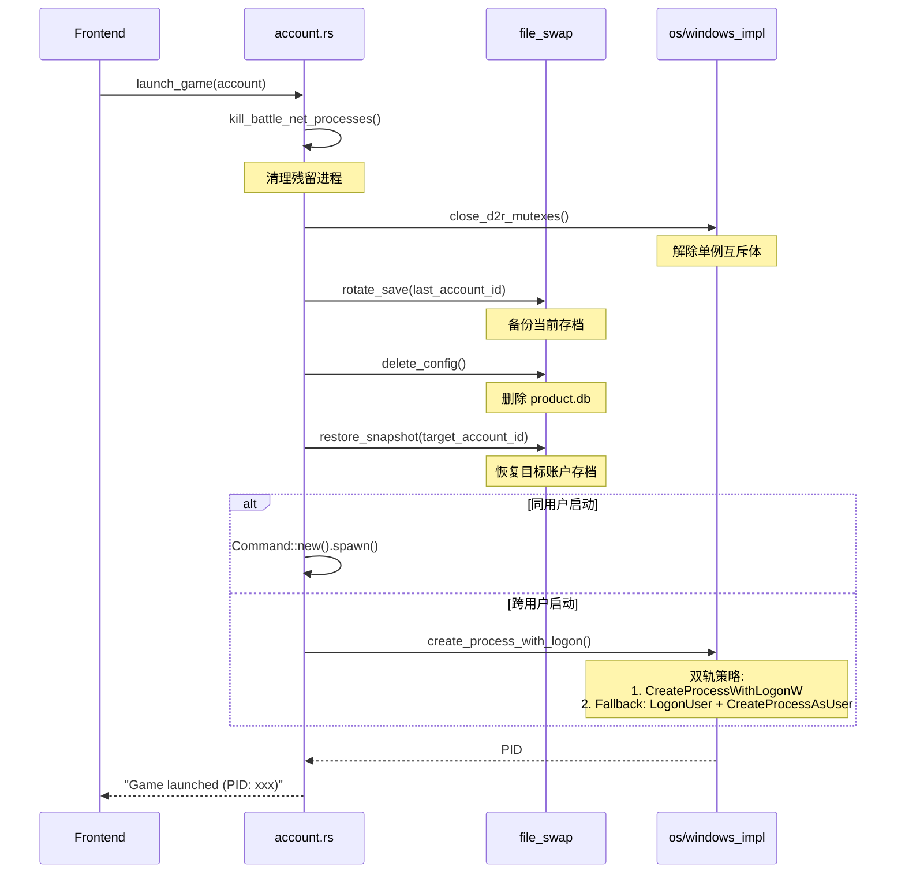

# D2R Multiplay - 技术架构规格书

> 版本: v3.0 (2026-02-07) | 基于 windows-rs 0.62.2 全面解耦重构

---

## 1. 模块地图

### 1.1 后端架构 (Rust/Tauri)

```
src-tauri/src/
├── lib.rs              # 入口点 + Tauri 命令注册 + State 管理 + 单实例插件
├── state.rs            # AppState (System/Users 缓存 + OSProvider)
├── build.rs            # 构建脚本 (Manifest 注入 + 管理员权限)
└── modules/
    ├── mod.rs          # 模块导出
    ├── account.rs      # 账户管理 + 游戏启动核心逻辑
    ├── config.rs       # 应用配置读写 (JSON)
    ├── file_swap.rs    # Battle.net 存档切换
    ├── mirror.rs       # Windows Junction 创建
    ├── process_killer.rs  # 进程清理
    ├── win_admin.rs    # 管理员权限检测 [新增]
    ├── os/             # 操作系统抽象层 [新增]
    │   ├── mod.rs      # OSProvider trait 定义
    │   └── windows_impl.rs  # Windows 实现 (用户管理 + 进程创建)
    └── win32_safe/     # Win32 API 安全封装层
        ├── mod.rs      # 模块导出
        ├── handle.rs   # HANDLE RAII 封装
        └── mutex.rs    # Mutex 操作
```

### 1.2 模块职责边界

| 模块 | 职责 | 不应包含 |
|:---|:---|:---|
| `os/*` | 跨平台抽象、用户管理、进程创建 | 业务逻辑 |
| `win32_safe/*` | 底层 Win32 API 封装（Mutex、Handle） | 业务逻辑、用户管理 |
| `account.rs` | 账户启动编排、进程状态查询 | Win32 直接调用 |
| `file_swap.rs` | 存档备份/恢复的文件操作 | 进程管理 |
| `win_admin.rs` | 管理员权限检测 | 业务逻辑 |
| `state.rs` | 全局缓存 + OSProvider 实例 | 业务逻辑 |

---

## 2. 核心工作流

### 2.1 游戏启动流程 (launch_game)



### 2.2 关键步骤顺序（不可调换）

1. **清理环境** → `kill_processes()` + `close_mutexes()`
2. **存档备份** → `rotate_save()` (保存当前状态)
3. **清空配置** → `delete_config()` (确保干净启动)
4. **恢复目标** → `restore_snapshot()` (加载目标账户)
5. **启动进程** → 同用户直接 spawn / 跨用户走 OSProvider

---

## 3. 新增功能 (v3.0)

### 3.1 管理员权限请求

- **实现**: `build.rs` 使用 `tauri-build::WindowsAttributes::app_manifest()` 注入 UAC Manifest
- **效果**: 程序启动时弹出 UAC 权限请求
- **检测**: `win_admin.rs` 提供 `is_admin()` 供前端显示状态

### 3.2 单实例机制

- **插件**: `tauri-plugin-single-instance`
- **行为**: 再次启动时自动激活现有窗口

### 3.3 跨用户启动双轨策略

- **问题**: 管理员模式下 `CreateProcessWithLogonW` 受 Windows 安全策略限制
- **方案**: 失败时自动切换到 `LogonUser` + `CreateProcessAsUser`

---

## 4. 依赖版本

```toml
[dependencies]
tauri = "2"
windows = "0.62.2"
sysinfo = "0.37.2"
tauri-plugin-single-instance = "2"
tauri-plugin-dialog = "2"
```

---

## 5. 前端接口

### Tauri 命令列表

| 命令 | 参数 | 返回 | 说明 |
|:---|:---|:---|:---|
| `launch_game` | account, game_path | PID | 启动游戏 |
| `check_admin` | - | bool | 检测管理员状态 |
| `get_windows_users` | deep_scan? | string[] | 获取用户列表 |
| `create_windows_user` | username, password | - | 创建用户 |
| `kill_mutexes` | - | count | 清理互斥体 |
| `kill_processes` | - | count | 清理进程 |
| `get_config` | - | AppConfig | 获取配置 |
| `save_config` | config | - | 保存配置 |
