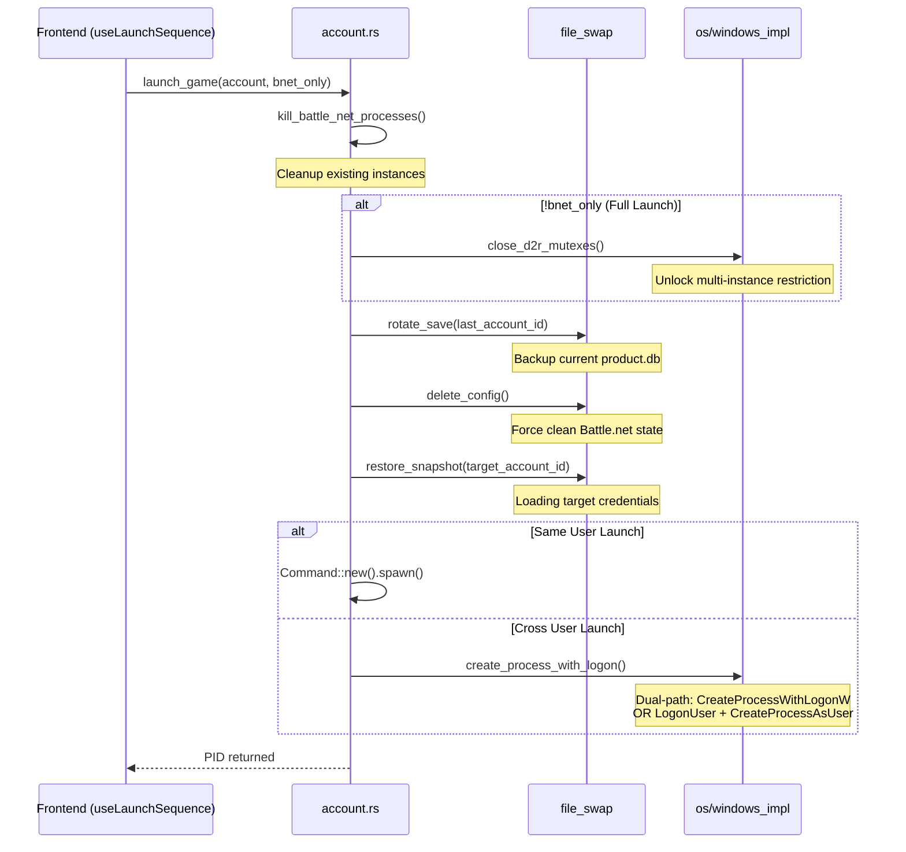

# D2R Multiplay - Technical Specification v4.0

> Version: v4.0 (2026-02-11) | AI-Optimized Documentation
> Focus: Modular Decomposition, Multi-Account Mode, Battle.net Only Launch

---

## 1. System Map

### 1.1 Backend Architecture (Rust/Tauri)

```
src-tauri/src/
├── lib.rs              # Entry point + Tauri Command Registration + State Management
├── state.rs            # AppState (Caching System/Users + OSProvider)
├── build.rs            # Build script (UAC Manifest Injection)
└── modules/
    ├── account.rs      # Account Management + Launch Orchestration
    ├── config.rs       # AppConfig Serialization (JSON)
    ├── file_swap.rs    # Battle.net Config Rotation (product.db)
    ├── mutex.rs        # Win32 Mutex manipulation (close_d2r_mutexes)
    ├── os/             # OS Abstraction Layer (Trait-based)
    │   ├── mod.rs      # OSProvider trait definition
    │   └── windows_impl.rs # Windows implementation using windows-rs
    └── win32_safe/     # Low-level Win32 RAII wrappers
```

### 1.2 Frontend Architecture (React 19)

```
src/
├── hooks/
│   ├── useAccountStatus.ts   # REAL-TIME Polling Logic (2s interval)
│   └── useLaunchSequence.ts  # COMPLEX Launch Business Logic (State Machine)
├── components/
│   ├── dashboard/
│   │   ├── DashboardHeader.tsx   # Title, Stats, View Mode Toggle
│   │   ├── LaunchActions.tsx     # Single/Multi Launch Buttons
│   │   ├── SortableAccountItem.tsx # Account Cards/List Items (DnD)
│   │   └── LogConsole.tsx        # Atomic Log Display
│   └── views/
│       └── Dashboard.tsx         # Lean Orchestrator (<150 lines)
└── lib/
    └── api.ts                    # Backend Command Facade
```

---

## 2. Core Workflows

### 2.1 Game Launch Sequence (launch_game)

The sequence is state-sensitive and requires strict ordering for data integrity.



### 2.2 Critical Data Protocols

1. **Mutex Protocol**: Must close `Diablo II Check For Other Instances` mutex *only* if full game launch is requested.
2. **Snapshot Protocol**: `product.db` rotation must happen *while* Battle.net is closed to prevent write-locks or token corruption.

---

## 3. Account Interaction Matrix

| Mode | Feature | Logic |
|:---|:---|:---|
| **Standard** | Single Start | Full preparation + Close Mutexes + Start Game |
| **Multi-Account** | One-click Start | Full preparation + Close Mutexes + Start Game |
| **Multi-Account** | Bnet Only | Full preparation + **KEEP** Mutexes (Identity Swap Only) |

---

## 4. Key Interfaces (API)

### AppConfig Schema additions

- `multi_account_mode: boolean`: Toggles dual-button UI.
- `close_to_tray: boolean`: Native tray behavior control.

### Tauri Command Update

- `launch_game(account: Account, gamePath: String, bnetOnly: bool)`: Added `bnet_only` flag to control mutex closing.

---

## 5. Component Philosophy

- **Container Pattern**: `Dashboard.tsx` is a pure container. No business logic allowed.
- **Hook Pattern**: Polling (`useAccountStatus`) and Async Flows (`useLaunchSequence`) MUST stay in hooks.
- **Atomic Rendering**: Components like `LogConsole` manage internal expansion state to minimize parent re-renders.
