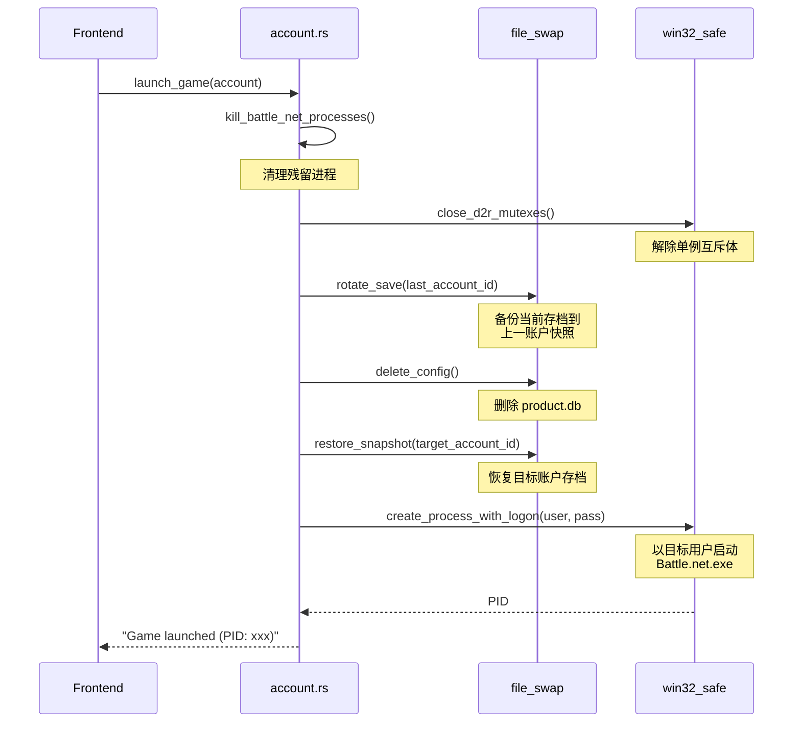

# D2R Multiplay - 技术架构规格书

> 版本: v2.0 (2026-01-24) | 基于架构优化后的最终状态

---

## 1. 模块地图

### 1.1 后端架构 (Rust/Tauri)

```
src-tauri/src/
├── lib.rs              # 入口点 + Tauri 命令注册 + State 管理
├── state.rs            # AppState (System/Users 缓存)
└── modules/
    ├── account.rs      # 账户管理 + 游戏启动核心逻辑
    ├── config.rs       # 应用配置读写 (JSON)
    ├── file_swap.rs    # Battle.net 存档切换
    ├── mirror.rs       # Windows Junction 创建
    ├── process_killer.rs  # 进程清理
    ├── win_user.rs     # Windows 用户管理
    └── win32_safe/     # Win32 API 安全封装层
        ├── handle.rs   # HANDLE RAII 封装
        ├── mutex.rs    # Mutex 操作
        └── process.rs  # CreateProcessWithLogonW 封装
```

**模块职责边界：**

| 模块 | 职责 | 不应包含 |
|:---|:---|:---|
| `win32_safe/*` | Win32 API 安全封装、错误转换 | 业务逻辑、配置读取 |
| `account.rs` | 账户启动编排、进程状态查询 | Win32 直接调用 |
| `file_swap.rs` | 存档备份/恢复的文件操作 | 进程管理 |
| `state.rs` | 全局缓存（System/Users） | 业务逻辑 |

---

## 2. 核心工作流

### 2.1 游戏启动流程 (launch_game)



**关键步骤顺序（不可调换）：**
1. **清理环境** → `kill_processes()` + `close_mutexes()`
2. **存档备份** → `rotate_save()` (保存当前状态)
3. **清空配置** → `delete_config()` (确保干净启动)
4. **恢复目标** → `restore_snapshot()` (加载目标账户)
5. **启动进程** → `create_process_with_logon()`

---

### 2.2 进程状态轮询 (get_accounts_process_status)

**优化前：**
```rust
// ❌ 每次调用创建新实例 (~50ms)
let mut sys = System::new_all();
sys.refresh_processes(All, true);
```

**优化后：**
```rust
// ✅ 使用 Tauri State 缓存 (~5ms)
let mut sys = state.sys.lock().unwrap();
sys.refresh_processes_specifics(
    ProcessesToUpdate::All,
    false,  // 不更新子进程
    ProcessRefreshKind::nothing()  // 仅刷新进程名
);
```

**性能指标：** 10倍提升 (50ms → 5ms)

---

## 3. 状态管理协议

### 3.1 Rust 后端 (Tauri State)

**定义位置：** `src-tauri/src/state.rs`

```rust
pub struct AppState {
    pub sys: Mutex<System>,    // 系统进程信息缓存
    pub users: Mutex<Users>,   // Windows 用户列表缓存
}
```

**注册位置：** `lib.rs::run()`
```rust
.manage(state::AppState::new())
```

**使用方式：** 在 Tauri Command 中注入
```rust
#[tauri::command]
fn some_command(state: tauri::State<'_, crate::state::AppState>) {
    let sys = state.sys.lock().unwrap();
    // ...
}
```

---

### 3.2 前端状态 (TypeScript/React)

**接口定义：** `src/lib/api.ts`

```typescript
export interface Account {
    id: string;
    win_user: string;
    win_pass?: string;
    bnet_account: string;
    avatar?: string;
    note?: string;
}

export interface AccountStatus {
    is_running: boolean;
    pid?: number;
    bnet_active?: boolean;  // Battle.net.exe 运行中
    d2r_active?: boolean;   // D2R.exe 运行中
}

export interface AppConfig {
    accounts: Account[];
    last_active_account?: string;
    theme_color?: string;
    close_to_tray?: boolean;
}
```

**调用约定：**
- 所有 Tauri 调用通过 `invoke(command, args)` 统一封装
- 返回 `Promise<T>` 或 `Promise<void>`
- 错误通过 `Result<T, String>` 传递

---

## 4. 配置文件规范

### 4.1 存储位置

**Windows:** `%APPDATA%/com.d2rmultiplay.ui/config.json`

### 4.2 存档快照

**位置:** `%APPDATA%/com.d2rmultiplay.ui/snapshots/`

**命名:** `product_{account_id}.db`

**原理:** 每次启动前备份当前 `product.db` 到上一账户的快照，然后恢复目标账户快照。

---

## 5. 性能基准

| 操作 | 优化前 | 优化后 | 提升 |
|:---|:---|:---|:---|
| 进程状态查询 | ~50ms | ~5ms | 10x |
| 启动窗口白屏 | 200-500ms | 0ms | 消除 |
| 配置加载 | 同步阻塞 | 异步 | N/A |

---

## 附录：依赖版本

```toml
[dependencies]
tauri = "2"
sysinfo = "0.37.2"
windows = "0.62.2"
```

**关键 API 变更：**
- `sysinfo 0.37+` 需使用 `ProcessRefreshKind::nothing()` 而非 `::new()`
