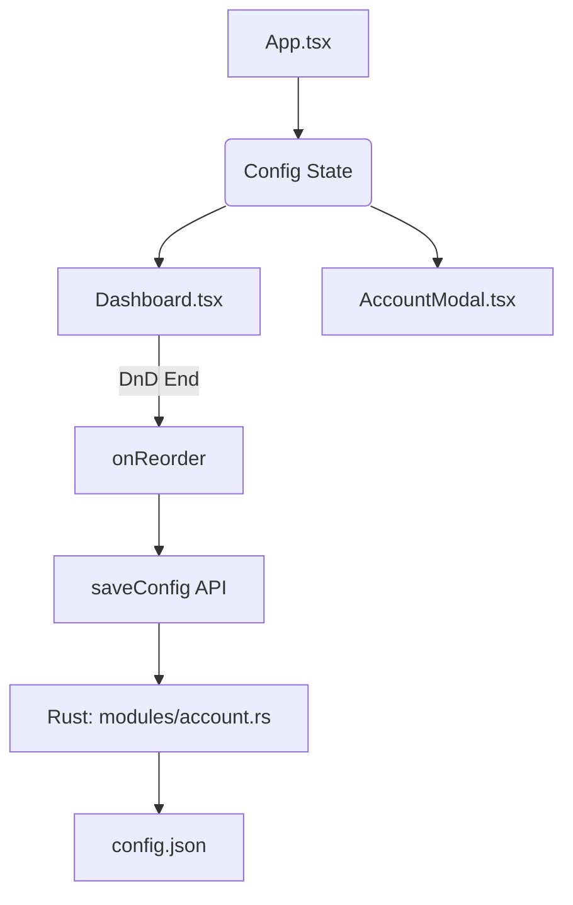

# 前端交互文档 (v2.6 Bento Update)

## 概览
本文档概述了 D2R Multiplay v2.6 的用户交互流程、状态管理和视觉反馈机制。

## 1. 界面图解 (Text-Based Wireframes)

### A. 仪表盘 (Dashboard) - 主界面 (Bento v2.6)
```text
+---------------------------------------------------------------+
| [LOGO] D2R Multi                                [Tab Selector]|
+---------------------------------------------------------------+
|                                                               |
| [卡片 1 (选中)]    [卡片 2]           [卡片 3]                  |
| +-----------+    +-----------+      +-----------+             |
| | [Ico] User|    | [Ico] User|      | [Ico] User|             |
| | ID: Main  |    | ID: Alt1  |      | ID: Alt2  |             |
| | (Notes...)|    | (Notes...)|      | (Notes...)|             |
| +-----------+    +-----------+      +-----------+             |
|                                                               |
| [卡片 4]           [...]              [...]                   |
|                                                               |
| +---------------------------------------------------------+   |
| |           [  (PLAY) 启动游戏 (START GAME)  ]              |   |
| +---------------------------------------------------------+   |
|                                                               |
+---------------------------------------------------------------+
```

### B. 列表模式 (Horizontal List Mode)
```text
+---------------------------------------------------------------+
| [Avatar] [Windows User] [Bnet ID]      [Remarks]       [Status]|
| +------+ +------------+ +------------+ +-------------+ +------+ |
| | [Pic]| LocalUser_01 | SorcMain     | Runes Store   | (B)(D) |
| +------+ +------------+ +------------+ +-------------+ +------+ |
+---------------------------------------------------------------+
```

## 2. 交互细节 (v2.6)

### A. 拖拽排序 (Drag-and-Drop)
*   **库**: 使用 `@dnd-kit`。
*   **触发**: 
    *   **列表模式**: 专用拖拽手柄 (`GripVertical`)。
    *   **卡片模式**: 鼠标点击并点击稍微位移 (>8px) 触发。
*   **状态维护**: `App.tsx` 响应 `onReorder` 并调用 `saveConfig` 持久化顺序。

### B. 账号模态框 (Account Modal)
*   **头像选择**: 顶部横向滚动选择内置 Class 图标，或者点击 [Sparkles] 图标上传本地图片。
*   **Base64 持久化**: 上传图片被编码为 Base64 字符串直接存入 `config.json`，确保便携性。
*   **移除字段**: 无需填写 "Region"，改为在备注中备注。

## 3. 视觉反馈 (Imperial Gold)
*   **字体加粗**: Bnet ID 和 备注 强制加粗，字号上调至 `16px` (text-base) 以适配高分屏。
*   **状态点**:
    *   **蓝色**: Battle.net 运行中。
    *   **翡翠色**: D2R 游戏运行中。

## 4. 架构图: 状态流转

