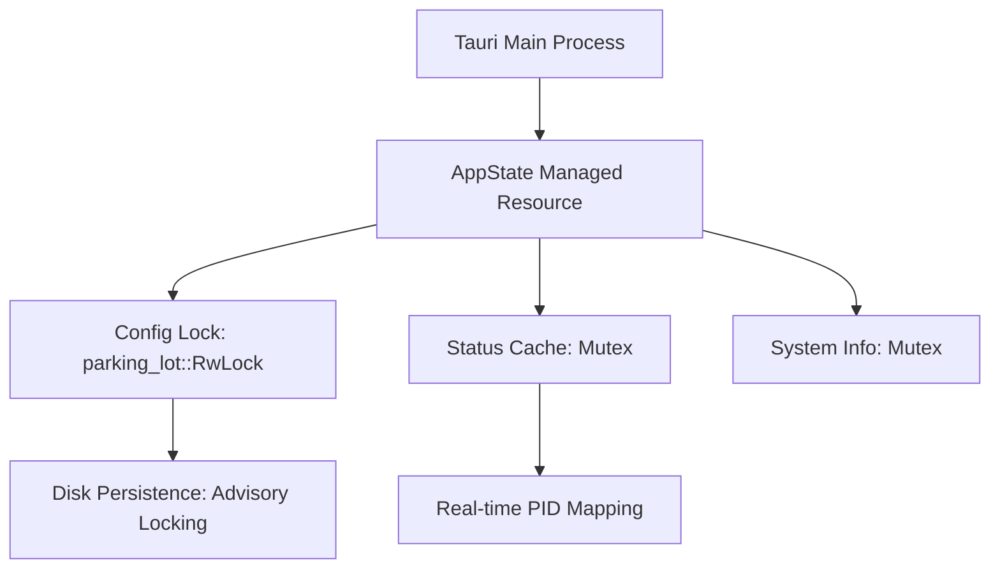

# ARCH: Deep-Systems Architecture & Concurrency Model

This document provides a low-level structural analysis of the `d2r-rust` architectural engine (v0.6.x). It defines the lifecycle, thread-safety primitives, and hardware abstraction boundaries required to replicate the system.

---

## 1. System Lifecycle & Initialization

The application follows a strictly sequenced initialization pattern to ensure that the environment is "Zero-Trust Ready" before any user interaction occurs.

### 1.1 Host Initialization Flow
1. **Entry Point (`main.rs`)**:
    - Initializes the `tracing-subscriber` with a `EnvFilter` (Default: `info`).
    - Spawns the Tauri runner.
2. **Main Process Setup (`lib.rs`)**:
    - **State Injection**: Injects `AppState` as a global managed resource via `.manage()`.
    - **Panic Hook**: Overrides standard panic to ensure log flushing before process termination.
    - **Tray Initialization**: Sets up the Windows System Tray menu (`tray.rs`) for background longevity.

### 1.2 Global Managed State (`state.rs`)
The system utilizes a structured `AppState` container wrapped in `tokio::sync` and `parking_lot` primitives for optimal concurrency.



#### Lock Specification:
- **`config`**: `parking_lot::RwLock<AppConfig>`. Optimized for frequent reads (UI polling) and infrequent atomic writes (Settings change).
- **`status`**: `Mutex<HashMap<String, AccountStatus>>`. Protects the real-time cache of running game instances.
- **`sys`**: `Mutex<sysinfo::System>`. Ensures serialized access to the `sysinfo` kernel-query engine to prevent race conditions in process enumeration.

---

## 2. OS Abstraction Strategy (Sovereignty)

The system is architected to remain "OS-Agnostic" at the logic level by utilizing the `OSProvider` trait abstraction (`modules/os/mod.rs`).

### 2.1 The `OSProvider` Trait Interface
The following interface defines the absolute minimum requirements for a host OS to support the application's alignment logic:

```rust
pub trait OSProvider: Send + Sync {
    /// Identity Retrieval
    fn get_whoami(&self) -> String;
    
    /// Process Orchestration
    fn create_process_with_logon(
        &self,
        user: &str,
        domain: Option<&str>,
        password: &str,
        exe_path: &str,
        args: Option<&str>,
        working_dir: Option<&str>,
    ) -> anyhow::Result<ProcessResult>;
}
```

### 2.2 Windows Implementation (`modules/os/windows`)
- Uses `windows-rs` for zero-overhead Win32 bindings.
- **Process Creation**: Leverages `CreateProcessWithLogonW` with the `LOGON_WITH_PROFILE` flag to ensure full registry hive loading for guest accounts.
- **SID Resolution**: Implements `LookupAccountSidW` and `ConvertSidToStringSidW` to translate binary kernel tokens into human-readable UIDs.

---

## 3. High-Frequency IPC & Data Contract

All communication between the Rust core and the WebView follows a strict JSON-RPC inspired contract defined in `src/lib/api.ts`.

### 3.1 Command Contract (Invoke)
| Command | Input | Logic Guard | Result |
| :--- | :--- | :--- | :--- |
| `launch_game` | `{ account: Account, ... }` | `win_admin::check` | `Result<u32, Error>` |
| `save_config` | `AppConfig` | `fd_lock` | `Result<(), Error>` |
| `get_windows_users` | `None` | `NetUserEnum` | `Vec<WinUser>` |

### 3.2 Event Streaming (Emit)
The system uses an asynchronous event bus to prevent blocking the UI during long-running OS tasks.
- **`launch-log`**: Payloads contain `{ account_id: string, message: string, level: string }`.
- **`config-updated`**: Emitted without payload to trigger a low-cost `getConfig` refresh across all open context providers.

---

**Technical Compliance**: `src-tauri/src/lib.rs`, `src-tauri/src/state.rs`  
**Quality Level**: Industrial State Persistence
